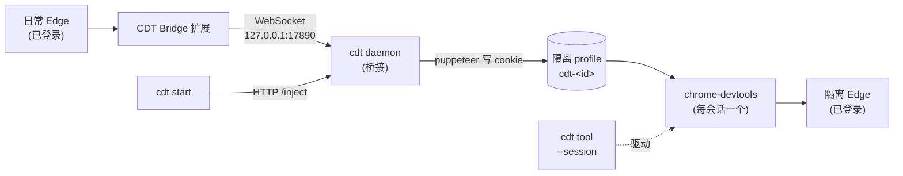

# cdt

[English](README.md) | [中文](README-ZH.md)

 

**cdt 从 shell 操控一个已登录的隔离 Edge。** 它通过浏览器扩展桥接复用你日常 Edge 的登录 cookie,启动的浏览器是你日常 Edge 的副本 —— 已登录、不涉及密码。它是 [chrome-devtools-mcp](https://github.com/ChromeDevTools/chrome-devtools-mcp) 的薄封装,把后者的 MCP 工具变成按需 shell 命令。

## 为什么需要

AI 自动化需要登录态的浏览器时,通常要在两个糟糕选项里选:让 AI 自己登录(撞验证码、2FA、反机器人),或者把密码硬编码进脚本(泄露)。cdt 走第三条路:AI 复用*你*日常 Edge 的会话。站点看到的是一个正常的、已认证的浏览器 —— 没有 AI 登录流程,代码里也没有密码。

## 特性

- **复用登录态** —— 扩展从日常 Edge 读 cookie,cdt 启动的隔离 Edge 已登录。
- **凭据留在本地** —— cookie 经 `127.0.0.1` 上的 WebSocket/HTTP 进入隔离 profile;不写进 cdt 配置,也不作为密码交给 AI。
- **会话隔离** —— 每次 `cdt start` 生成独立的短 session id、profile、Edge 进程;并发 AI 窗口互不共享浏览器。
- **按需 CLI** —— chrome-devtools-mcp 的每个工具(`navigate_page`、`take_snapshot`、`click`、`fill`…)都是一条 shell 命令,用 `--session=<id>` 作用域。
- **自动清理** —— `start`/`prepare` 自动回收死会话*和*卡住的启动(daemon 活但 Edge 没起来);正在用的会话绝不被杀。
- **AI skill 就绪** —— 一条命令把 cdt skill 装进 Claude Code 和 Codex。

## 工作原理



四个部件协作:

1. **CDT Bridge 扩展**(装在日常 Edge)—— 通过 `chrome.cookies` API 读 cookie,经本地 WebSocket 推送。
2. **cdt daemon**(`bridge/daemon.mjs`,常驻)—— 持有扩展连接的 WebSocket server,加一个 cdt 调用的 HTTP server(`127.0.0.1:17891`):`/status`、`/cookies`、`/inject`。
3. **cdt CLI**(`cdt.ps1`)—— 你和 AI 跑的入口。`start` 让 daemon 把 cookie 注入新的隔离 profile,再把它交给 chrome-devtools。
4. **chrome-devtools-mcp** —— 启动并驱动隔离 Edge:每个 session id 一个 daemon + 一个浏览器。

## 环境要求

- **Windows** —— CLI 入口是 PowerShell(`cdt.ps1`);`bin/cdt.mjs` 是透传 shim。daemon 和扩展是可移植 JS,目前只有 CLI 胶水层是 Windows 专属。
- **Edge** —— 既是日常浏览器(cookie 源),也是自动化目标。
- **Node ≥ 18** 在 PATH,全局 npm `bin` 目录在 PATH(`cdt`、`chrome-devtools` 才能解析)。

## 安装(一次性)

在 cdt 源码目录:

```sh
npm i -g .
cdt doctor
```

`cdt doctor` 会补装 `chrome-devtools-mcp` CLI(若缺失)、探测 Edge 路径写入 config、**并启动 cdt daemon**。

在日常 Edge 加载 **CDT Bridge** 扩展:跑 `cdt extension` 打印路径,然后 `edge://extensions` → 开发者模式 → "加载解压缩的扩展" → 选那个目录。popup 应显示**已连接**。

确认桥接:

```sh
cdt prepare     # 报告扩展状态 + cookie 数
```

(可选)把 skill 部署到 AI 工具,让 AI 能驱动 cdt:

```sh
cdt skills install --targets all     # ~/.claude/skills/cdt、~/.codex/skills/cdt
```

## 用法

```sh
cdt start                                # 注入 cookie + 启隔离 Edge;打印 session=<id>
cdt navigate_page --session=<id> --type url --url https://github.com
cdt take_snapshot --session=<id>         # 显示你的已登录主页 → 链路通
cdt stop --session=<id>
```

`cdt start` 打印的 `session=<id>`,后续每条命令都要带上。

## 命令

| 命令 | 作用 |
|---|---|
| `cdt prepare` | 确保 daemon 在跑 + 报告扩展状态(会先自动清孤儿) |
| `cdt start` | 自动清理 + 注入 cookie + 启隔离 Edge;打印 sessionId(不可自定义) |
| `cdt <tool> --session=<id> [args]` | 转发给 chrome-devtools(`navigate_page`、`take_snapshot`、`click`、`fill`…) |
| `cdt stop --session=<id>` | 停会话 + 杀残留 Edge + 删 profile + 清标记 |
| `cdt sessions list` | 列出会话(alive/orphan)+ profile |
| `cdt sessions clean` | 清死/卡住会话的标记 + profile |
| `cdt config set <k> <v>` | 设配置(`executable`/`httpPort`/`wsPort`/`profilesDir`) |
| `cdt doctor` | 装 chrome-devtools CLI + 探测 Edge + 检查扩展 |
| `cdt extension` | 打印扩展目录(去 `edge://extensions` 加载) |
| `cdt skills install\|status\|update\|uninstall` | 管理 AI skill(`--targets claude,codex\|all`) |
| `cdt uninstall` | 删 skill + 包 |

## 会话 & 自动清理

每次 `cdt start` 建一个带短随机 id 的隔离会话。`cdt start` 和 `cdt prepare` 会先自动清理一次。当一个会话:

- **已死** —— chrome-devtools daemon 不再运行;或
- **卡住** —— daemon 活着,但 Edge 超过 90s 没起来(启动卡住了);

就会被回收。Edge 是活会话的心跳:**daemon 活 + Edge 在 = 正常 → 不动**;daemon 活但过了宽限期还没 Edge = 卡住 → 及时清。正在用的会话绝不被杀;卡住的不用等重启。

## 配置

```sh
cdt config set executable "C:\Program Files (x86)\Microsoft\Edge\Application\msedge.exe"
cdt config set httpPort 17891
cdt config set profilesDir "D:\cdt-profiles"
cdt config list
```

每次运行时读取,注入进进程环境。配置在 `~/.cdt/config.json`。

## 故障排除

- **`cdt start` 卡住 / 不打印 session id** —— Edge 启动偶尔卡死(chrome-devtools-mcp/Edge 的怪癖)。杀掉再跑 `cdt start`;上次卡住的会话会在下次运行时自动清掉。
- **扩展显示未连接** —— 跑 `cdt doctor`(重启 daemon),或点扩展 popup 里的重连。扩展会在后台自动重试。
- **`session <id> was not started`** —— 你忘了带 `cdt start` 打印的 `--session=<id>`,或会话已被自动清理。跑 `cdt start` 拿新 id。
- **`cdt start` 碰到 session id 冲突** —— 极罕见;先判断这个会话是不是你自己起的,是才 `cdt stop`,否则再跑一次 `cdt start`。

## 状态 & 限制

cdt 是早期、Windows 优先的工具(CLI 入口是 PowerShell)。它封装 [chrome-devtools-mcp](https://github.com/ChromeDevTools/chrome-devtools-mcp)(Google 官方项目)。已知粗糙点:Edge 启动偶尔会卡 —— 自动清理正是为吸收这种情况设计的。

## 卸载

```sh
cdt uninstall                      # 删部署的 skill + 包
Remove-Item -Recurse $HOME\.cdt    # 配置/profiles/sessions(手动)
```

日常 Edge 里也卸载 **CDT Bridge** 扩展。
