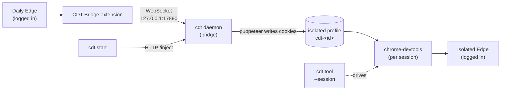

# cdt

[English](README.md) | [中文](README-ZH.md)

 

**cdt drives an isolated, already-logged-in Edge from the shell.** It reuses your daily Edge's login cookies through a browser-extension bridge, so the browser it launches is a copy of your daily Edge — signed in, with no passwords involved. It's a thin CLI wrapper over [chrome-devtools-mcp](https://github.com/ChromeDevTools/chrome-devtools-mcp), turning its MCP tools into on-demand shell commands.

## Why

When an AI agent automates a browser that needs a login, you usually pick between two bad options: let the AI log in itself (it hits CAPTCHAs, 2FA, anti-bot walls), or hard-code credentials into the script (they leak). cdt takes a third path: the AI reuses *your* daily Edge session. The site sees a normal, already-authenticated browser — no AI login flow, no credentials in code.

## Features

- **Reuses your login state** — a browser extension reads cookies from your daily Edge; the isolated Edge cdt launches is already logged in.
- **Credentials stay local** — cookies travel over a WebSocket/HTTP on `127.0.0.1` into an isolated profile; they're never written to cdt's config or handed to the AI as passwords.
- **Session isolation** — each `cdt start` spins up its own short session id, profile, and Edge process; concurrent AI windows never share a browser.
- **On-demand CLI** — every chrome-devtools-mcp tool (`navigate_page`, `take_snapshot`, `click`, `fill`, …) becomes a shell command, scoped by `--session=<id>`.
- **Self-cleaning** — `start`/`prepare` auto-reap dead sessions *and* hung launches (daemon alive but Edge never came up); a working session is never killed.
- **Default extensions, with settings** — whitelisted extensions from your daily Edge (ad blocker, downloader, userscripts…) load into every isolated session already configured, not freshly installed — like opening a new window, not a new browser.
- **Popups suppressed** — translate bubble, certificate-error pages, site permission prompts (notifications/location/camera/mic), and the download save dialog are pre-disabled so they don't block automation.
- **AI-skill ready** — one command installs the cdt skill into Claude Code and Codex.

## How it works



Four pieces cooperate:

1. **CDT Bridge extension** (loaded in your daily Edge) — reads cookies via the `chrome.cookies` API and pushes them over a local WebSocket.
2. **cdt daemon** (`bridge/daemon.mjs`, resident) — runs the WebSocket server the extension connects to, plus an HTTP server on `127.0.0.1:17891` that cdt calls: `/status`, `/cookies`, `/inject`.
3. **cdt CLI** (`cdt.ps1`) — what you and the AI run. `start` asks the daemon to inject cookies into a fresh isolated profile, then hands that profile to chrome-devtools.
4. **chrome-devtools-mcp** — launches and drives the isolated Edge: one daemon + one browser per session id.

## Requirements

- **Windows** — the CLI entry point is PowerShell (`cdt.ps1`); `bin/cdt.mjs` is a shim that forwards to it. The daemon and extension are portable JS; only the CLI glue is Windows-specific for now.
- **Edge** — both your daily browser (the cookie source) and the automation target.
- **Node ≥ 18** on PATH, and the global npm `bin` directory on PATH (so `cdt` and `chrome-devtools` resolve).

## Installation (one-time)

In the cdt source directory:

```sh
npm i -g .
cdt doctor
```

`cdt doctor` installs the `chrome-devtools-mcp` CLI if missing, detects the Edge path into config, **and starts the cdt daemon**.

Load the **CDT Bridge** extension in your daily Edge: run `cdt extension` to print its path, then `edge://extensions` → Developer mode → "Load unpacked" → select that directory. The popup should show **connected**.

Confirm the bridge:

```sh
cdt prepare     # reports extension status + cookie count
```

(Optional) Deploy the skill to AI tools so the AI can drive cdt:

```sh
cdt skills install --targets all     # ~/.claude/skills/cdt, ~/.codex/skills/cdt
```

## Usage

```sh
cdt start                                # inject cookies + launch isolated Edge; prints session=<id>
cdt navigate_page --session=<id> --type url --url https://github.com
cdt take_snapshot --session=<id>         # shows your logged-in home → it works
cdt stop --session=<id>
```

Reuse the `session=<id>` from `cdt start` on every following command.

## Commands

| Command | Purpose |
|---|---|
| `cdt prepare` | Ensure daemon running + report extension status (auto-cleans orphans first) |
| `cdt start` | Auto-clean + inject cookies + launch isolated Edge; prints sessionId (not customizable) |
| `cdt <tool> --session=<id> [args]` | Forward to chrome-devtools (`navigate_page`, `take_snapshot`, `click`, `fill`, …) |
| `cdt stop --session=<id>` | Stop session + kill leftover Edge + delete profile + clear marker |
| `cdt sessions list` | List sessions (alive/orphan) + profiles |
| `cdt sessions clean` | Remove markers + profiles for dead or hung sessions |
| `cdt config set <k> <v>` | Set config (`executable` / `httpPort` / `wsPort` / `profilesDir` / `defaultProfile`) |
| `cdt extensions list\|add\|remove` | Manage the default-load extension whitelist (by name or ID) |
| `cdt doctor` | Install chrome-devtools CLI + detect Edge + detect default profile + check extension |
| `cdt extension` | Print extension dir (load at `edge://extensions`) |
| `cdt skills install\|status\|update\|uninstall` | Manage the AI skill (`--targets claude,codex\|all`) |
| `cdt uninstall` | Remove skill + package |

## Sessions & automatic cleanup

Each `cdt start` creates an isolated session with a short random id. `cdt start` and `cdt prepare` first run an automatic cleanup. A session is reaped when:

- **dead** — its chrome-devtools daemon is no longer running; or
- **hung** — the daemon is alive but Edge never came up for over 90s (a stuck launch).

Edge is the heartbeat: **daemon alive + Edge up = working → left alone**; daemon alive + Edge absent past the grace window = stuck → cleaned promptly. A working session is never killed; a hung one doesn't wait for a reboot.

## Configuration

```sh
cdt config set executable "C:\Program Files (x86)\Microsoft\Edge\Application\msedge.exe"
cdt config set httpPort 17891
cdt config set profilesDir "D:\cdt-profiles"
cdt config set defaultProfile "%LOCALAPPDATA%\Microsoft\Edge\User Data"
cdt config list
```

Read on every run. Config lives in `~/.cdt/config.json`. Keys: `executable`, `httpPort`, `wsPort`, `profilesDir`, `defaultProfile` (your daily profile — the read-only source for extensions).

## Default extensions & popup suppression

Every `cdt start` copies your whitelisted extensions' **code + `chrome.storage`** into the isolated profile, then loads them with `install_extension`. Because store extensions ship a `manifest.key`, the loaded ID equals the one in your daily profile, so each extension reads its already-copied `chrome.storage` — it runs already configured, not freshly installed. This is decoupled from cookies: cookies still arrive via the extension bridge (App-Bound Encryption blocks copying them), while `chrome.storage` has no such protection and copies cleanly.

Configure the whitelist once by name — cdt resolves it to the stable extension ID:

```sh
cdt extensions list                 # show installed extensions (* = whitelisted)
cdt extensions add "AdGuard"        # add by name fragment or 32-char ID
cdt extensions remove "AdGuard"
```

`cdt doctor` auto-detects `defaultProfile`. Popups are pre-suppressed on every session: translate bubble, certificate-error pages (`--acceptInsecureCerts`), site permission prompts (notifications/location/camera/mic), and the download save dialog — so they don't block `click`/`fill`.

## Troubleshooting

- **`cdt start` hangs / prints no session id** — Edge launching occasionally stalls (a chrome-devtools-mcp/Edge quirk). Kill it and run `cdt start` again; the previous hung session is auto-cleaned on the next run.
- **Extension shows disconnected** — run `cdt doctor` (restarts the daemon), or click reconnect in the extension popup. The extension retries in the background.
- **`session <id> was not started`** — you forgot the `--session=<id>` from `cdt start`, or the session was auto-cleaned. Run `cdt start` for a fresh id.
- **A session id collision on `cdt start`** — extremely rare; first decide whether you started that session yourself, only `cdt stop` it if you did, otherwise just `cdt start` again.

## Status & limitations

cdt is an early-stage, Windows-first tool (the CLI entry point is PowerShell). It wraps [chrome-devtools-mcp](https://github.com/ChromeDevTools/chrome-devtools-mcp), an official Google project. Known rough edge: Edge launching can intermittently stall — the automatic cleanup is designed to absorb exactly this.

## Uninstall

```sh
cdt uninstall                      # removes the deployed skill + the package
Remove-Item -Recurse $HOME\.cdt    # config/profiles/sessions (manual)
```

Also remove the **CDT Bridge** extension in daily Edge.
